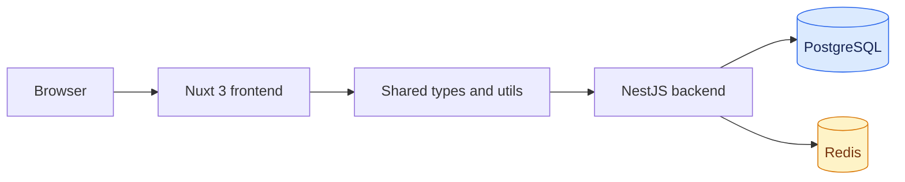

# Weave

> Where people, work, and data connect.

Weave 是一个面向 Workspace 的人员与组织数据平台原型，基于数据表对组织信息进行管理。

项目使用 pnpm 管理前端、后端和共享 TypeScript 包。

## 当前能力

当前版本已经可以运行认证、管理和 Dataset API，并提供数据表列表与编辑页面。Form HTTP API 与业务编辑能力仍在建设中。下面的文档以仓库当前代码为准，不把 OpenSpec 设计或预留导航当作已完成能力。

项目当前能力、实现边界和未暴露的内部领域服务，详见 [`docs/current-capabilities.md`](docs/current-capabilities.md)。

## 技术架构



PostgreSQL 保存持久化领域数据和审计记录。Redis 保存 Session、OTP、认证挑战、MFA 状态和限流计数。

| 层 | 目录 | 主要职责 |
| --- | --- | --- |
| Frontend | `app/frontend/` | Nuxt 页面、认证流程、Pinia 状态和统一 API Client |
| Backend | `app/backend/` | NestJS HTTP API、认证、授权、用户、Workspace、审计和领域服务 |
| Shared types | `packages/types/` | API envelope、身份、权限、Dataset、Form 和 JSON 类型 |
| Shared utils | `packages/utils/` | 身份规范化、密码策略、JSON 稳定化、checksum、Schema 和条件表达式工具 |
| Persistence | `app/backend/prisma/` | Prisma Schema、PostgreSQL 迁移和关系约束 |

Dataset 使用固定的 PostgreSQL 关系模型：普通字段值存储在 `DatasetRow.values` JSON 中，关系字段存储在 `DatasetRelation` 中。项目不为每个 Dataset 动态创建 PostgreSQL 表；Dataset 定义和每行数据都通过版本表保留历史快照。

## 目录结构

```text
.
├── app/
│   ├── backend/
│   │   ├── src/                 # NestJS 模块和领域服务
│   │   ├── prisma/              # schema.prisma 和 migrations
│   │   ├── api/openapi.yml      # OpenAPI 静态文档
│   │   └── test/                # 后端 Vitest 测试
│   └── frontend/
│       ├── pages/               # Nuxt 页面
│       ├── components/          # 认证和 Dashboard 组件
│       ├── composables/         # 认证流程
│       ├── stores/               # Pinia 状态
│       └── utils/                # 前端 API、重定向工具
├── packages/
│   ├── types/                   # 跨应用类型和权限注册表
│   └── utils/                   # 跨应用无框架工具
├── compose.dev.yml              # 仅 PostgreSQL + Redis
├── compose.yml                  # 前后端和依赖服务
├── scripts/                     # OpenAPI 维护脚本
└── .env.example                 # 环境变量模板
```

## 环境要求

- Node.js 22 或更高版本。
- pnpm 10 或更高版本。仓库锁定的 package manager 版本为 `pnpm@10.20.0`。
- Docker 和 Docker Compose。开发环境依赖 PostgreSQL 17 与 Redis 7.4。

## 本地开发

### 1. 配置环境变量

```bash
cp .env.example .env
```

开发环境至少需要确认 `POSTGRES_*`、`DATABASE_URL`、`REDIS_URL`、`REDIS_PASSWORD` 和本地端口配置。`.env` 已被 Git 忽略；不要提交真实密钥。

### 2. 启动依赖服务并执行迁移

```bash
pnpm start:db
pnpm migrate
```

`pnpm start:db` 使用 `compose.dev.yml` 启动 PostgreSQL 和 Redis。`pnpm migrate` 会执行 `app/backend/prisma/migrations/` 中的 Prisma 部署迁移；首次初始化管理员前必须先完成这一步。

### 3. 启动应用

同时启动前后端：

```bash
pnpm dev
```

也可以分别启动：

```bash
pnpm dev:backend
pnpm dev:frontend
```

默认地址如下：

| 服务 | 地址 |
| --- | --- |
| Frontend | <http://localhost:6771> |
| Backend | <http://localhost:6770> |
| Health check | <http://localhost:6770/health> |
| Swagger UI | <http://localhost:6770/docs> |
| OpenAPI JSON | <http://localhost:6770/docs-json> |
| OpenAPI YAML | <http://localhost:6770/docs-yaml> |

后端开发模式会在配置端口被占用时尝试下一个可用端口，并在启动日志中打印实际地址。

### 4. 创建首个管理员

在已经完成迁移的空数据库上运行：

```bash
pnpm bootstrap:admin --email=admin@example.com
```

命令会交互式收集用户名、姓名、昵称和密码，并在同一事务中创建用户、默认 Workspace（ID `1`）、所有者成员、默认角色、`workspace_admin` 和 `system_admin`。命令不会接受密码命令行参数。

非交互环境可以使用部署系统注入的环境变量：

```bash
BOOTSTRAP_ADMIN_EMAIL=admin@example.com \
BOOTSTRAP_ADMIN_USERNAME=admin \
BOOTSTRAP_ADMIN_NAME='System Administrator' \
BOOTSTRAP_ADMIN_NICKNAME=Admin \
BOOTSTRAP_ADMIN_PASSWORD='use-a-strong-secret' \
pnpm bootstrap:admin --non-interactive
```

只应对未初始化的数据库运行该命令。重复运行不会覆盖现有凭据、所有权或授权。

## 生产部署

完整容器栈使用 `compose.yml`：

```bash
pnpm start
```

后端容器启动时会依次执行 `prisma migrate deploy`、`bootstrap:admin --non-interactive`，然后启动 NestJS；前端容器运行 Nuxt 生产构建。首次初始化空数据库时，必须通过部署平台的密钥注入全部 `BOOTSTRAP_ADMIN_*` 变量，以创建 Admin 账户。已有系统管理员时该步骤不会读取这些变量或修改现有账户，因此后续部署可以移除这些一次性密钥。外部端口由 `FRONTEND_PORT` 和 `BACKEND_PORT` 控制，默认分别为 `6771` 和 `6770`。

生产环境必须在启动前设置随机的 `JWT_SECRET`、`AUTH_HMAC_SECRET` 和 `TOTP_ENCRYPTION_KEY`，显式设置认证 TTL，并为 `WEBAUTHN_ORIGINS` 使用 HTTPS。后端在 `NODE_ENV=production` 下会拒绝开发回退密钥、隐式 TTL 和非 HTTPS WebAuthn origin。

## 环境变量概览

完整变量和默认值请以 [`.env.example`](.env.example) 为准。

| 分组 | 变量 | 用途 |
| --- | --- | --- |
| 应用 | `PORT`、`NUXT_PORT`、`BACKEND_PORT`、`FRONTEND_PORT` | 本地进程和 Docker 对外端口 |
| PostgreSQL | `POSTGRES_DB`、`POSTGRES_USER`、`POSTGRES_PASSWORD`、`POSTGRES_PORT`、`DATABASE_URL` | Prisma 持久化数据库 |
| Redis | `REDIS_PORT`、`REDIS_PASSWORD`、`REDIS_URL` | Session、OTP、MFA challenge 和限流状态 |
| JWT/认证 | `JWT_SECRET`、`JWT_ISSUER`、`JWT_AUDIENCE`、各类 `*_TTL_SECONDS` | Access Token、Refresh Session 和认证生命周期 |
| 安全密钥 | `AUTH_HMAC_SECRET`、`TOTP_ENCRYPTION_KEY` | OTP/限流摘要和 TOTP 密钥加密 |
| WebAuthn | `WEBAUTHN_RP_ID`、`WEBAUTHN_RP_NAME`、`WEBAUTHN_ORIGINS` | Passkey RP 和允许的 origin |
| Workspace | `DEFAULT_WORKSPACE_ID` | 当前版本固定为 `1` |
| 首次初始化 | `BOOTSTRAP_ADMIN_EMAIL`、`BOOTSTRAP_ADMIN_USERNAME`、`BOOTSTRAP_ADMIN_NAME`、`BOOTSTRAP_ADMIN_NICKNAME`、`BOOTSTRAP_ADMIN_PASSWORD` | 仅在空数据库首次启动时创建 Admin；密码必须由密钥管理服务注入 |
| 部署 origin | `APP_ORIGIN`、`API_ORIGIN`、`PASSKEY_ORIGIN`、`PASSKEY_RP_ID` | CORS、Swagger server 和生产访问地址 |

## HTTP API

后端通过全局拦截器返回统一成功 envelope：

```json
{
  "status": "success",
  "data": {},
  "timestamp": "2026-01-01T00:00:00.000Z"
}
```

错误响应使用相同结构，`data` 为 `null`，并包含 `message`。受保护接口使用 `Authorization: Bearer <access-token>`。前端 API Client 会自动注入 Token、解包成功响应并转换错误。

当前已注册的 HTTP 路由按领域分组如下：

| 路由组 | 内容 |
| --- | --- |
| `/health` | 公开健康检查 |
| `/auth/*` | 注册、登录、刷新、登出、密码、MFA、Passkey、手机号和会话 |
| `/user/*` | 当前用户资料、用户列表、用户状态和强制登出 |
| `/workspaces/*` | 默认 Workspace、成员和成员类型 |
| `/workspaces/:workspaceId/roles` | 角色、角色权限、成员角色和直接权限 |
| `/system-administrators` | 系统管理员授予、撤销和查询 |
| `/audit-logs` | 受权限保护的审计查询 |
| `/workspaces/:workspaceId/datasets` | Dataset 列表、创建、详情、元数据与归档 |
| `/workspaces/:workspaceId/datasets/:datasetId/fields/*` | 字段定义和关联目标选项 |
| `/workspaces/:workspaceId/datasets/:datasetId/rows/*` | 绝对窗口查询、行创建、局部更新和软删除 |

运行中的 Swagger 文档由 NestJS 根据当前 Controller 生成。`app/backend/api/openapi.yml` 是仓库中的静态契约文件，包含 Dataset HTTP 边界；Form 领域目前仍没有 HTTP Controller。

## 认证与安全模型

- 用户邮箱和用户名在校验、查询和持久化前统一规范化。
- 密码使用 Argon2id 哈希，密码策略要求 9–128 个可见 ASCII 字符，并命中四类字符中的至少三类。
- Access JWT 不携带权限快照；请求通过全局认证/权限 Guard 根据当前 Workspace 状态解析 Actor。
- Refresh Token 只以摘要形式保存在 Redis。单次轮换失败会触发 Session 撤销，密码变更会使旧会话失效。
- OTP 只保存 HMAC 摘要，具备过期、尝试次数、请求频率和单次消费限制。
- Passkey 使用 WebAuthn；TOTP 密钥加密保存，并拒绝同一时间步重复使用。
- 权限解析顺序为角色权限、直接 allow、直接 deny；系统管理员和 Workspace 管理员拥有相应的管理员覆盖能力。
- 资源服务会校验 Workspace 边界，跨 Workspace 的成员、角色、Dataset 和关系不能互相引用。

## 通知服务限制

`NotificationsService` 当前的邮件和短信方法是刻意保留的 no-op mock。认证层会生成并安全存储验证码，但不会发送真实邮件或短信，也不会把验证码写入日志。

在接入真实邮件/SMS 提供商并完成部署验证前，不应在生产环境启用邮箱验证码登录、密码找回、邮箱 MFA、SMS MFA 或手机号绑定。TOTP 和 Passkey 不依赖这两个 mock 方法。

## 测试、检查与构建

仓库根目录提供以下检查命令：

```bash
pnpm lint
pnpm typecheck
pnpm build
```

后端测试：

```bash
pnpm --filter @weave/backend test
```

前端测试目前没有 package script，可以直接运行 Vitest：

```bash
pnpm --filter @weave/frontend exec vitest run
```

测试覆盖认证安全策略、OTP/MFA/Session、权限解析、Workspace 边界、Dataset HTTP DTO/能力/窗口/关联选项、Dataset/Form 服务、特殊 Dataset 事务、统一 API 响应、Pinia Token 状态、Dataset 前端查询适配和 API 错误处理。

## 开发约定

- 跨前后端使用的类型放在 `packages/types/src/`，框架无关的工具放在 `packages/utils/src/`。
- 修改 Prisma Schema 后先运行 `pnpm --filter @weave/backend prisma:generate`，再创建或部署迁移。
- 不要编辑 `dist/`、`.nuxt/` 或 `.output/` 生成目录。
- 遵循仓库现有的 TypeScript/Vue 风格：严格类型、两空格缩进、单引号、分号、尾逗号，以及 Vue 3 `<script setup lang="ts">`。
- 新增或修改后端写操作时，应沿用现有的 Workspace 边界、事务、乐观锁和审计模式。

## 相关文档

- [后端认证与初始化说明](app/backend/README.md)
- [共享工具包说明](packages/utils/README.md)
- [Prisma 数据模型](app/backend/prisma/schema.prisma)
- [静态 OpenAPI 文档](app/backend/api/openapi.yml)
- [OpenSpec 变更设计](openspec/changes/)

## 许可证

项目目前采用 MIT License。后续可能会根据业务需求调整为更严格的开源协议。
